# practica-3-red

Práctica 3. Una red propia, dos máquinas y una aplicación  
Computación en la Nube · Universidad Francisco de Paula Santander

---

## 1. Identificación

**Equipo**

| Integrante | Código |
|---|---|
| Michell Mahecha | 1152407 |
| Cristian Zambrano | 1152408 |
| Scharid Maldonado | 1152418 |

- **Proyecto de Google Cloud:** `computanube`
- **Prefijo usado en los recursos:** `maldonado`


---

## 2. Diagrama de la infraestructura

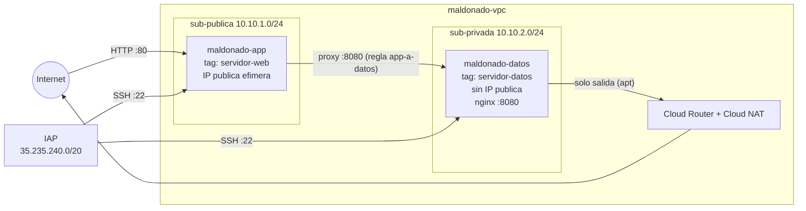

- **Entrada pública:** el tráfico de internet llega por el puerto 80 a `maldonado-app`, que es la única máquina con IP pública (efímera). La regla `permitir-http` lo permite solo hacia la etiqueta `servidor-web`.
- **Comunicación interna:** la aplicación (nginx como proxy) consulta a `maldonado-datos` por su IP interna en el puerto 8080. La regla `permitir-app-a-datos` solo acepta ese tráfico si viene de la etiqueta `servidor-web`.
- **Salida privada:** `maldonado-datos` no tiene IP pública. Solo sale a internet (para instalar paquetes) a través de Cloud Router y Cloud NAT, y nadie de fuera puede iniciar una conexión hacia ella.
- **Administración:** el SSH (puerto 22) solo se permite desde `35.235.240.0/20`, el rango desde el que Google reenvía las conexiones de IAP.

---

## 3. Evidencias

## Evidencias

### - Evidencia 0


### - Evidencia 1
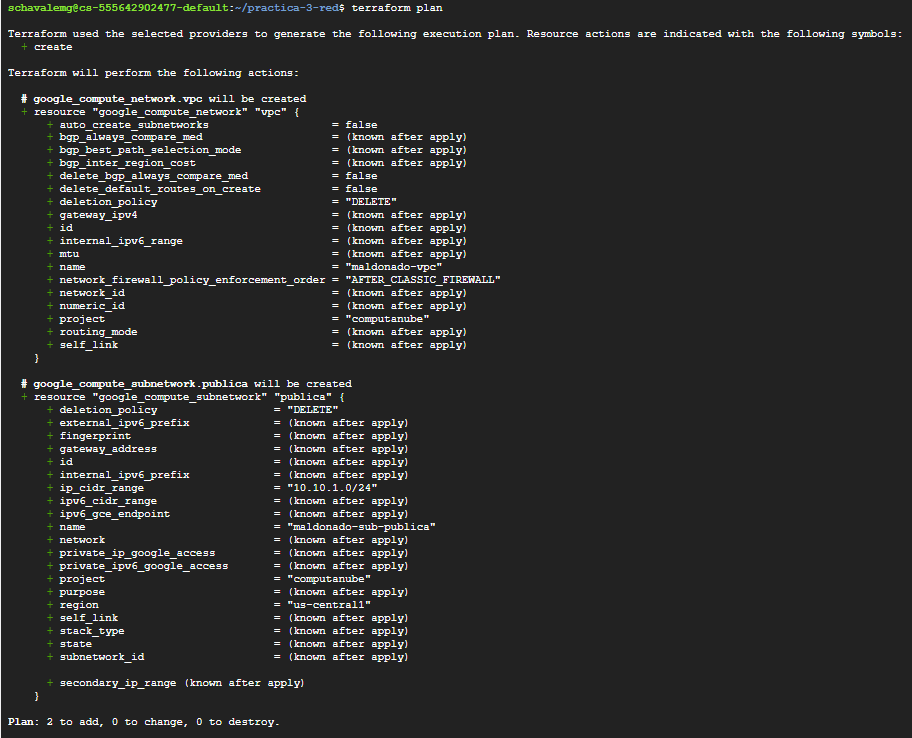

### - Evidencia 2
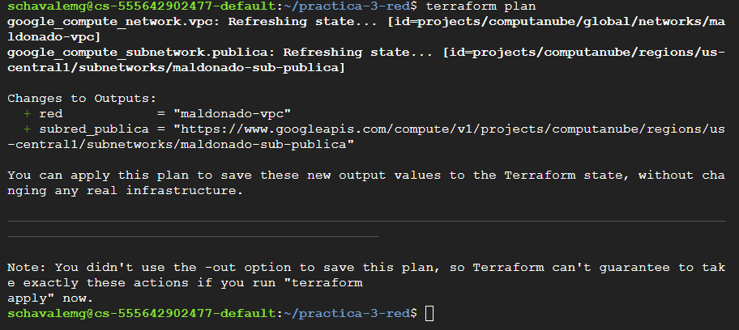

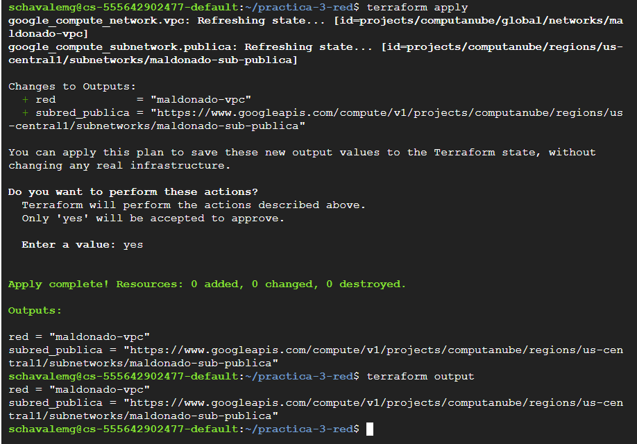

### - Evidencia 3
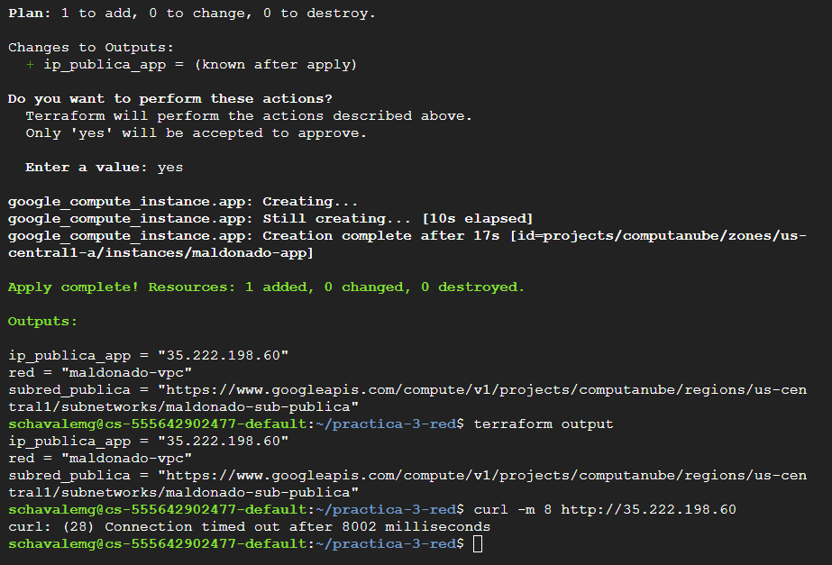

### - Evidencia 4
- Aplicacion en dispositivo

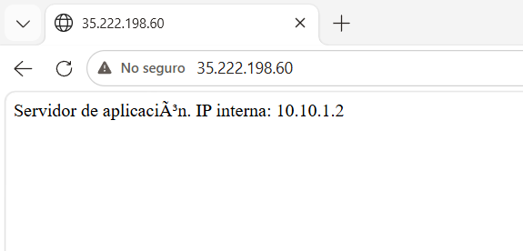

- Reglas de cortafuegos

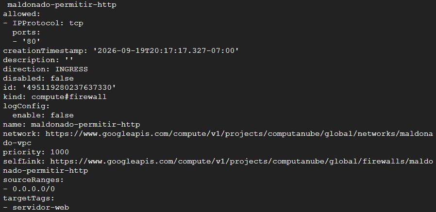

- Sesion SSH establecida por IAP

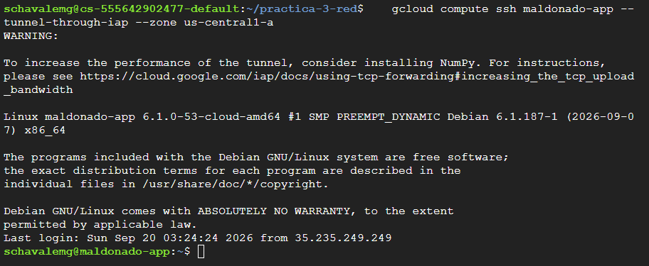

### - Evidencia 5

- final destroy y ambos listados vacios

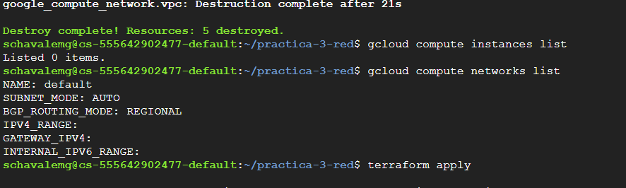

- apply

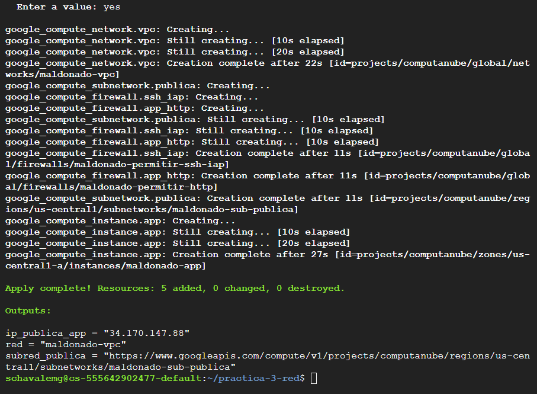


### - Evidencia 6

- Aplicac mostrando el dato de la maquina privada

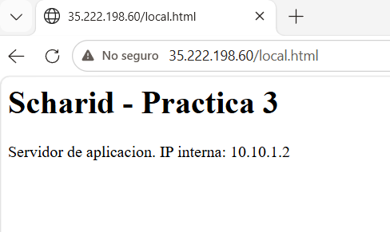

- Prueba de aislamiento desde fuera: la maquina de datos no responde

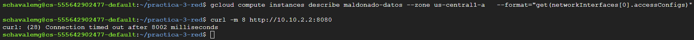

- Prueba de aislamiento desde dentro: la máquina de datos sí responde

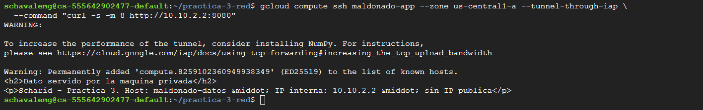

## 4. Comandos ejecutados

```bash
# Fase 0: preparación
terraform version
gcloud config list
gcloud services enable compute.googleapis.com
git clone https://github.com/ScharidMG/practica-3-red.git
cd practica-3-red

# Fases 1 a 4: construcción
terraform init
terraform plan
terraform apply
terraform output
git pull
curl -m 8 http://<IP-PUBLICA>
gcloud compute ssh maldonado-app --tunnel-through-iap

# Fase 5: reproducir desde cero
terraform destroy
gcloud compute instances list
gcloud compute networks list
terraform apply

# Fase 6: correcciones y reconstrucción con la red completa
git pull
file arranque.sh.tftpl arranque_datos.sh.tftpl
terraform destroy
terraform apply
curl -m 8 http://<IP-PUBLICA>
curl -m 8 http://<IP-PUBLICA>/local.html

# Fase 6: pruebas de aislamiento
gcloud compute instances describe maldonado-datos --zone us-central1-a \
  --format="get(networkInterfaces[0].accessConfigs)"
curl -m 8 http://10.10.2.2:8080
gcloud compute ssh maldonado-app --zone us-central1-a --tunnel-through-iap \
  --command "curl -s -m 8 http://10.10.2.2:8080"

# Verificación del estado antes de entregar
git ls-files
```

**El estado no está en el repositorio.** El `.gitignore` excluye `.terraform/`, `*.tfstate`, `*.tfstate.*` y `crash.log`, y `git ls-files` no lista ningún `.tfstate` ni el directorio `.terraform/`.

---

## 5. Decisiones libres

1. **Qué se despliega en la máquina de datos:** nginx en el puerto 8080. Es un servicio HTTP que se instala con `apt` a través del NAT y se prueba con un simple `curl`; se eligió el 8080 (y no el 80) para que el puerto de la regla `permitir-app-a-datos` fuera una decisión explícita. Con PostgreSQL (5432) habrían cambiado el paquete, el puerto de la regla y el "dato" sería una consulta y no una página.
2. **Organización de los archivos `.tf`:** un solo `main.tf` dividido en secciones (red, NAT, máquinas, cortafuegos), más `variables.tf` y `outputs.tf`. Son solo 10 recursos y así se leen de arriba abajo; el orden en que están escritos no afecta a Terraform, que lo deduce del grafo de dependencias. Dividirlo en varios archivos o módulos tendría sentido si la red creciera.
3. **Administración de la máquina sin IP pública:** SSH a través del túnel de IAP (`--tunnel-through-iap`), con el puerto 22 abierto solo al rango `35.235.240.0/20`. Permite una consola interactiva sin exponer el 22 a internet ni crear un bastión, pero no sirve para que un usuario final llegue a un servicio y depende de la regla `permitir-ssh-iap` y de los permisos de IAM.
4. **Direccionamiento de las subredes:** `10.10.1.0/24` (pública) y `10.10.2.0/24` (privada), del bloque privado `10.0.0.0/8`, contiguas, sin solaparse y con unas 250 direcciones útiles cada una. Si mañana hubiera que conectar esta red con otra, los rangos no deben pisarse; si otra red usara `10.10.0.0/16`, habría que migrar, porque cambiar el rango de una subred con máquinas obliga a recrearlas.

---

## 6. Preguntas

**Si le quitas la etiqueta de red a la máquina de aplicación y aplicas, ¿qué deja de funcionar exactamente, y por qué la regla de cortafuegos sigue existiendo?**

Dejan de funcionar tres cosas, porque las tres reglas de cortafuegos identificaban a la app por esa etiqueta:

app_http (puerto 80) apunta a servidor-web, así que la app ya no coincide y el HTTP desde internet se descarta. El curl se queda esperando hasta agotar el tiempo.
ssh_iap también apuntaba a servidor-web, así que pierden el SSH por IAP a la app.
app_a_datos usa source_tags = ["servidor-web"], así que la app dejaría de ser un origen válido hacia la máquina de datos.

nginx sigue corriendo dentro de la app, porque la máquina no se reinició. El servidor funciona, pero la red no deja pasar el tráfico.

**¿Por qué el `plan` de la fase 2 no propuso ningún cambio, si el código era distinto? ¿Qué habrías tenido que cambiar para que sí propusiera recrear un recurso?**

Terraform no compara el texto del código. Evalúa el código, sustituye las variables, y compara el resultado con lo que ya existe. Al pasar valores escritos a mano a variables con los mismos valores, los argumentos finales (nombre, rango, región) son idénticos, así que no hay nada que modificar.

Para que propusiera recrear algo, habría que cambiar un argumento que el proveedor no puede modificar en caliente, y el plan lo marca # forces replacement.

**Con la red completa encendida, ¿cuánto costaría un mes? Desglosa por recurso y señala cuál es el que más sorprende.**

Estimación con precios de lista de us-central1, 720 horas al mes, tráfico despreciable y discos pd-standard de 10 GB (el tipo que muestra el plan de Terraform):

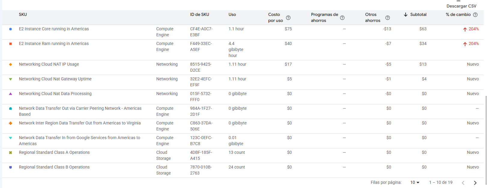

| Recurso | Cálculo | USD/mes |
|---|---|---|
| 2 máquinas e2-micro | ≈ 6.1 cada una | ≈ 12.2 |
| 2 discos de arranque pd-standard de 10 GB | 0.04 USD/GB-mes × 10 GB × 2 | ≈ 0.8 |
| IP pública efímera de la aplicación | 0.005 USD/h × 720 h | ≈ 3.6 |
| Cloud NAT, puerta de enlace | 0.0014 USD/h × 1 VM × 720 h | ≈ 1.0 |
| Cloud NAT, IP externa del gateway | 0.005 USD/h × 720 h (al menos una) | ≈ 3.6 |
| Cloud NAT, datos procesados | 0.045 USD/GiB, casi sin tráfico | ≈ 0 |
| VPC, dos subredes, Cloud Router y 3 reglas de cortafuegos | gratuitos | 0 |
| *Total aproximado* | | *≈ 21* |

Lo que más sorprende es Cloud NAT: aunque la puerta de enlace en sí cuesta apenas 1 USD, el NAT necesita su propia IP externa que se cobra por hora, de modo que el conjunto (≈ 4.6 USD) equivale a casi tres cuartas partes de lo que cuesta una de las máquinas, y se cobra por existir aunque las dos máquinas estén apagadas. Es el primer recurso del curso que factura por estar creado y no por trabajar, y por eso se hace terraform destroy al terminar cada sesión de trabajo. El total es una estimación con precios de lista, no una factura. Como contraste, el informe de facturación del proyecto por SKU (en pesos colombianos) registró, durante el tiempo que la red estuvo encendida, 1.11 horas de uso tanto de la IP como de la puerta de enlace de Cloud NAT y 4.4 GiB-hora de memoria en las instancias, lo que corresponde a un NAT con una IP y a dos e2-micro de 1 GiB. El cargo de las instancias (75 COP de vCPU y 40 COP de memoria) repartido en 4.4 horas-máquina da unos 26 COP por hora, es decir, unos 0.0084 USD por hora y por e2-micro a un cambio aproximado de 3,100 COP por dólar (≈ 6 USD al mes), que es el valor usado en la tabla; y la proporción entre los cargos de la IP del NAT y de la puerta de enlace (17 a 5) coincide con la de las tarifas de lista. Esos cargos quedaron cubiertos por descuentos y créditos promocionales, por lo que el total facturado fue de 0.